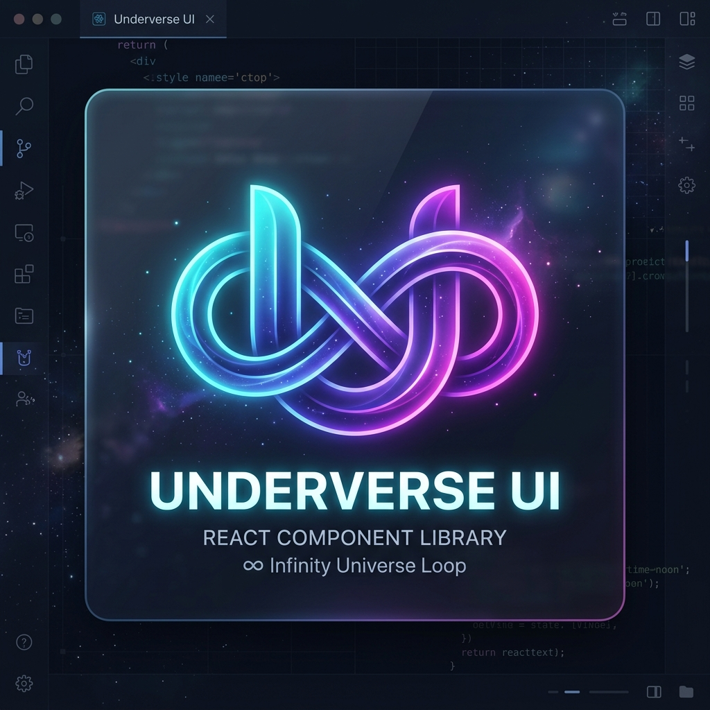

<p align="center">
  
</p>

<h1 align="center">Underverse UI</h1>

<p align="center">
  Production-focused React components for forms, data-heavy interfaces, overlays, scheduling, and rich-text editing.
</p>

<p align="center">
  <a href="https://www.npmjs.com/package/@underverse-ui/underverse"></a>
  <a href="https://www.npmjs.com/package/@underverse-ui/underverse"></a>
  <a href="https://github.com/faker6996/underverse/actions/workflows/quality.yml"></a>
  <a href="LICENSE"></a>
</p>

<p align="center">
  <a href="https://underverse.infiniq.com.vn/vi/docs/underverse">Documentation</a>
  ·
  <a href="https://www.npmjs.com/package/@underverse-ui/underverse">npm</a>
  ·
  <a href="packages/underverse/CHANGELOG.md">Changelog</a>
  ·
  <a href="https://github.com/faker6996/underverse/issues">Issues</a>
</p>

## Why Underverse

- More than 60 typed components, from basic controls to DataTable, CalendarTimeline, and UEditor.
- React 18+ support with ESM and CommonJS package outputs.
- Tailwind CSS 4 design tokens, dark-mode support, and global component configuration.
- Built-in English, Vietnamese, Korean, and Japanese UI messages.
- Keyboard and ARIA behavior covered by component interaction tests.
- Public API metadata and bundle budgets verified before package publishing.

## Installation

```bash
npm install @underverse-ui/underverse
```

The package declares its framework and feature integrations as peer dependencies. Use React 18 or newer and Tailwind CSS 4 in the consuming application.

## Quick start

```tsx
"use client";

import {
  Button,
  DatePicker,
  TranslationProvider,
  UnderverseConfigProvider,
} from "@underverse-ui/underverse";

export function Example() {
  return (
    <TranslationProvider locale="en">
      <UnderverseConfigProvider config={{ borderMode: "lg" }}>
        <div className="flex items-center gap-3">
          <DatePicker onChange={(date) => console.log(date)} />
          <Button>Continue</Button>
        </div>
      </UnderverseConfigProvider>
    </TranslationProvider>
  );
}
```

`TranslationProvider` is optional. Components fall back to English when it is not mounted.

## Tailwind CSS setup

Tailwind ignores dependencies in `node_modules` during automatic source detection. Register the package from the stylesheet that imports Tailwind:

```css
@import "tailwindcss";
@source "../node_modules/@underverse-ui/underverse/dist";
```

The source path is relative to that stylesheet, so adjust `../` when the file lives under `src/app` or another nested directory. See Tailwind's [explicit source registration](https://tailwindcss.com/docs/detecting-classes-in-source-files#explicitly-registering-sources) documentation.

Underverse uses semantic Tailwind tokens. Applications that already use shadcn-style tokens can reuse them. A minimal starter map looks like this:

<details>
<summary>Show starter theme tokens</summary>

```css
:root {
  --background: oklch(0.98 0.005 255);
  --foreground: oklch(0.22 0.012 255);
  --card: oklch(1 0 0);
  --card-foreground: var(--foreground);
  --popover: oklch(1 0 0);
  --popover-foreground: var(--foreground);
  --primary: oklch(0.55 0.18 255);
  --primary-foreground: oklch(0.985 0 0);
  --secondary: oklch(0.58 0.12 280);
  --secondary-foreground: oklch(0.985 0 0);
  --muted: oklch(0.955 0.01 255);
  --muted-foreground: oklch(0.4 0.012 255);
  --accent: color-mix(in oklch, var(--primary) 16%, var(--background));
  --accent-foreground: var(--foreground);
  --destructive: oklch(0.56 0.19 22);
  --destructive-foreground: oklch(0.985 0 0);
  --success: oklch(0.52 0.16 145);
  --success-foreground: oklch(0.985 0 0);
  --warning: oklch(0.62 0.16 60);
  --warning-foreground: oklch(0.16 0.012 255);
  --info: oklch(0.62 0.14 210);
  --info-foreground: oklch(0.985 0 0);
  --border: oklch(0.7 0.01 255 / 22%);
  --input: oklch(0.7 0.01 255 / 30%);
  --ring: color-mix(in oklch, var(--primary) 70%, var(--background));
  --primary-soft: color-mix(in oklch, var(--primary) 12%, var(--background));
  --secondary-soft: color-mix(in oklch, var(--secondary) 12%, var(--background));
  --destructive-soft: color-mix(in oklch, var(--destructive) 12%, var(--background));
  --success-soft: color-mix(in oklch, var(--success) 12%, var(--background));
  --warning-soft: color-mix(in oklch, var(--warning) 14%, var(--background));
  --info-soft: color-mix(in oklch, var(--info) 12%, var(--background));
  --input-focus: var(--ring);
  --input-disabled: var(--muted);
  --input-invalid: var(--destructive);
  --surface-0: var(--background);
  --surface-1: oklch(0.99 0.006 255);
  --surface-2: oklch(0.98 0.007 255);
  --surface-3: oklch(0.97 0.008 255);
  --shadow-xs: 0 1px 2px rgb(0 0 0 / 5%);
  --shadow-sm: 0 1px 3px rgb(0 0 0 / 10%);
  --shadow-md: 0 4px 6px rgb(0 0 0 / 10%);
  --shadow-lg: 0 10px 15px rgb(0 0 0 / 10%);
  --shadow-xl: 0 20px 25px rgb(0 0 0 / 12%);
}

@theme inline {
  --color-background: var(--background);
  --color-foreground: var(--foreground);
  --color-card: var(--card);
  --color-card-foreground: var(--card-foreground);
  --color-popover: var(--popover);
  --color-popover-foreground: var(--popover-foreground);
  --color-primary: var(--primary);
  --color-primary-foreground: var(--primary-foreground);
  --color-primary-soft: var(--primary-soft);
  --color-secondary: var(--secondary);
  --color-secondary-foreground: var(--secondary-foreground);
  --color-secondary-soft: var(--secondary-soft);
  --color-muted: var(--muted);
  --color-muted-foreground: var(--muted-foreground);
  --color-accent: var(--accent);
  --color-accent-foreground: var(--accent-foreground);
  --color-destructive: var(--destructive);
  --color-destructive-foreground: var(--destructive-foreground);
  --color-destructive-soft: var(--destructive-soft);
  --color-success: var(--success);
  --color-success-foreground: var(--success-foreground);
  --color-success-soft: var(--success-soft);
  --color-warning: var(--warning);
  --color-warning-foreground: var(--warning-foreground);
  --color-warning-soft: var(--warning-soft);
  --color-info: var(--info);
  --color-info-foreground: var(--info-foreground);
  --color-info-soft: var(--info-soft);
  --color-border: var(--border);
  --color-input: var(--input);
  --color-ring: var(--ring);
  --color-input-focus: var(--input-focus);
  --color-input-disabled: var(--input-disabled);
  --color-input-invalid: var(--input-invalid);
  --color-surface-0: var(--surface-0);
  --color-surface-1: var(--surface-1);
  --color-surface-2: var(--surface-2);
  --color-surface-3: var(--surface-3);
  --shadow-xs: var(--shadow-xs);
  --shadow-sm: var(--shadow-sm);
  --shadow-md: var(--shadow-md);
  --shadow-lg: var(--shadow-lg);
  --shadow-xl: var(--shadow-xl);
  --ease-soft: cubic-bezier(0.25, 1, 0.5, 1);
}
```

For the complete light/dark palette, see the [color system](docs/COLOR_SYSTEM.md).

</details>

## Imports and bundle size

The existing root entry remains the standard public API:

```tsx
import { Button, DataTable, UEditor } from "@underverse-ui/underverse";
```

It is tree-shakeable and protected by a package bundle budget. No import migration is required when upgrading.

For an application that only uses the editor, the explicit UEditor entry creates a smaller, clearer module boundary:

```tsx
import UEditor, { type UEditorRef } from "@underverse-ui/underverse/ueditor";
```

Do not deep-import files under `dist` or `src`; only the root and `/ueditor` entries are public contracts.

## UEditor

UEditor is a Tiptap-based rich-text editor with slash commands, menus, uploads, tables, formulas, cell formatting, resizing, and spreadsheet paste support.

```tsx
"use client";

import { useRef, useState } from "react";
import UEditor, { type UEditorRef } from "@underverse-ui/underverse/ueditor";

export function ArticleEditor() {
  const editorRef = useRef<UEditorRef>(null);
  const [html, setHtml] = useState("<p>Start writing…</p>");

  return (
    <UEditor
      ref={editorRef}
      content={html}
      onHtmlChange={setHtml}
      outputDebounceMs={120}
      placeholder="Type '/' for commands…"
      showCharacterCount
    />
  );
}
```

Use `outputDebounceMs` for large controlled documents. Before persisting base64 images, call `editorRef.current?.prepareContentForSave()` with an upload handler.

[Read the UEditor guide](docs/underverseui-usage/UEditor.md) · [Read the table guide](docs/underverseui-usage/UEditor-Table-HuongDanSuDung.md)

## Internationalization

Standalone React applications can use the built-in provider:

```tsx
import { TranslationProvider } from "@underverse-ui/underverse";

<TranslationProvider locale="vi">{children}</TranslationProvider>;
```

Supported locales:

| Code | Language |
| --- | --- |
| `en` | English |
| `vi` | Tiếng Việt |
| `ko` | 한국어 |
| `ja` | 日本語 |

For a `next-intl` application, mount `NextIntlAdapter` inside `NextIntlClientProvider`. The adapter reads the active locale and messages, then falls back to the package's built-in locale messages for missing component strings.

## Optional integrations

Install and configure only the integrations used by your application:

| Feature | Integration |
| --- | --- |
| Forms and schema validation | `react-hook-form`, `@hookform/resolvers`, `zod` |
| UEditor | Tiptap, Lowlight, and Tippy peers declared by the package |
| Overlay scrollbars | `overlayscrollbars` and its stylesheet |
| Next.js image/i18n adapters | `next`, `next-intl` |

Overlay scrollbars are opt-in and component-scoped:

```tsx
import "overlayscrollbars/overlayscrollbars.css";
import {
  OverlayScrollbarProvider,
  ScrollArea,
} from "@underverse-ui/underverse";

<OverlayScrollbarProvider autoHide="leave">
  <ScrollArea className="h-64" useOverlayScrollbar>
    {content}
  </ScrollArea>
</OverlayScrollbarProvider>;
```

## Component families

| Area | Components |
| --- | --- |
| Inputs | Input, Textarea, CheckBox, RadioGroup, Switch, Slider, TagInput |
| Selection | Combobox, MultiCombobox, CategoryTreeSelect, ColorPicker |
| Date and time | Calendar, DatePicker, DateRangePicker, DateTimePicker, TimePicker, MonthYearPicker |
| Data | Table, DataTable, Pagination, Grid, List, Timeline |
| Navigation | Tabs, Breadcrumb, DropdownMenu, Section, ScrollArea |
| Overlays | Modal, Sheet, Popover, Tooltip, Toast, Alert |
| Media and content | SmartImage, ImageUpload, FileUpload, Carousel, EmojiPicker, StickerPicker, UEditor |
| Scheduling | CalendarTimeline |

Browse every component, example, and generated API contract in the [live documentation](https://underverse.infiniq.com.vn/vi/docs/underverse).

## Compatibility

| Runtime | Support |
| --- | --- |
| React | 18 and newer |
| Node.js | 18 and newer |
| Next.js | 13 and newer |
| Tailwind CSS | 4.x |
| Module formats | ESM and CommonJS |
| TypeScript | Type declarations included |

## Contributing and security

Repository setup, test commands, and pull-request rules live in [CONTRIBUTING.md](CONTRIBUTING.md). Please report vulnerabilities through the process in [SECURITY.md](SECURITY.md), not through a public issue.

## License

[MIT](LICENSE) © Tran Van Bach
